<div align="center">

# 🎮 ClashCode — Learn C++ Through Play

### A gamified, interactive learning platform for mastering C++ basics through quizzes, levels, and instant feedback.

<br/>

> **"Stop reading boring theory. Play games, take quizzes, and master C++ — one level at a time! 🚀"**

<br/>
</div>

---

## 📚 Table of Contents

- [About The Project](#-about-the-project)
- [Features](#-features)
- [Screenshots](#-screenshots)
- [Pages Overview](#-pages-overview)
- [Tech Stack](#-tech-stack)
- [Project Structure](#-project-structure)
- [Getting Started](#-getting-started)
- [C++ Topics Covered](#-c-topics-covered)
- [Quiz System](#-quiz-system)
- [Components](#-components)
- [Contributing](#-contributing)

---

## 🎯 About The Project

**ClashCode** is a beginner-friendly, gamified web application that transforms the way students learn C++ programming. Instead of reading dry textbooks, students learn through:

- 🎮 **Interactive quizzes** with instant feedback
- 🏆 **Score tracking** to measure progress
- 📊 **Level progression** (Beginner → Intermediate → Advanced)
- 💡 **Short, focused concept cards** with real code snippets
- 🔄 **Restart & next-level** system to reinforce learning

The platform is designed to make C++ approachable, fun, and addictive — so students keep coming back to level up their skills.

---

## ✨ Features

| Feature | Description |
|---|---|
| 🎮 **Gamified Quizzes** | MCQ-style questions with color-coded correct/wrong feedback |
| 📈 **Score System** | Real-time score tracking with percentage and emoji rating |
| 🔢 **Progress Bar** | Visual quiz progress indicator per topic |
| 🎚 **Level Filtering** | Filter topics by Beginner / Intermediate / Advanced |
| 💻 **Code Snippets** | Syntax-highlighted preview of each C++ concept |
| 📱 **Responsive Design** | Fully mobile-friendly with hamburger navigation |
| 🌐 **Multi-page Routing** | Smooth navigation via React Router DOM |
| 🔄 **Restart Quiz** | Retry any topic's quiz without page reload |
| ✉️ **Contact Form** | Validated form with success confirmation screen |
| 🌙 **Dark Neon Theme** | Retro arcade aesthetic with neon glow effects |

---

## 🖼️ Screenshots

### 🏠 Hero Section

| Desktop | Mobile |
|---------|--------|
| 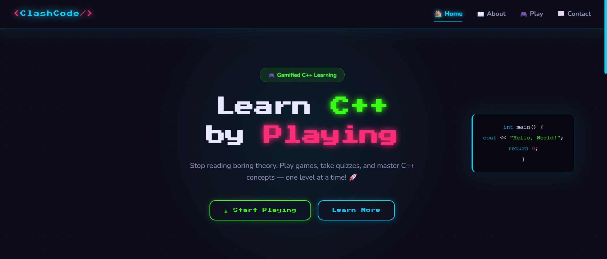 | 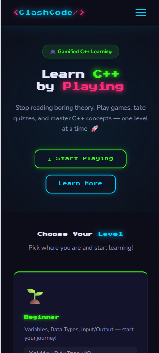 |

---

### 📖 About Page

| Desktop | Mobile |
|---------|--------|
| 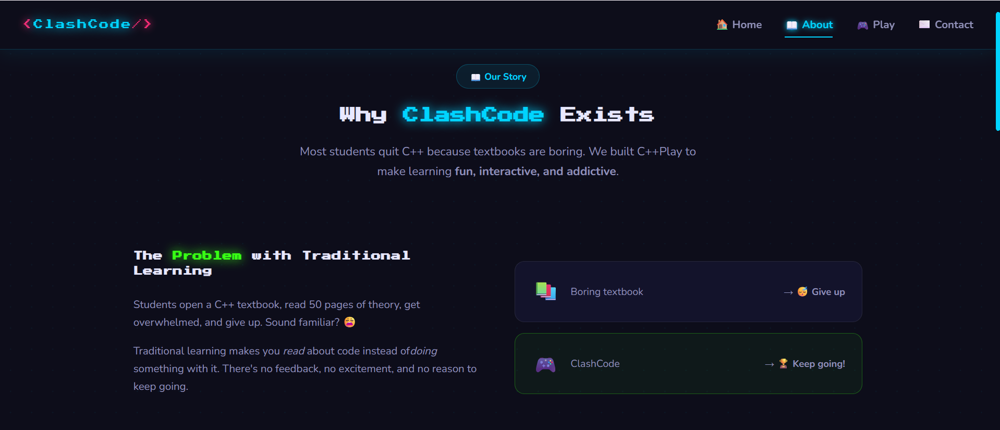 | 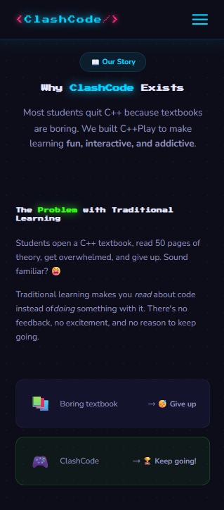 |
| 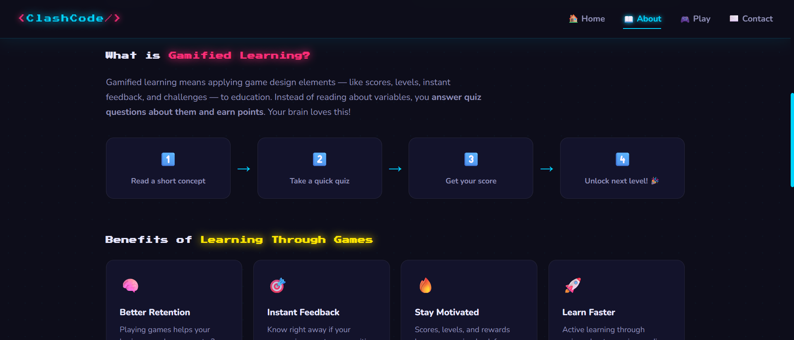 | 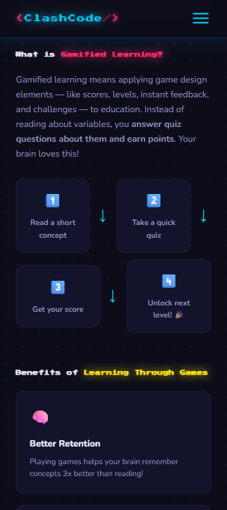 |
| 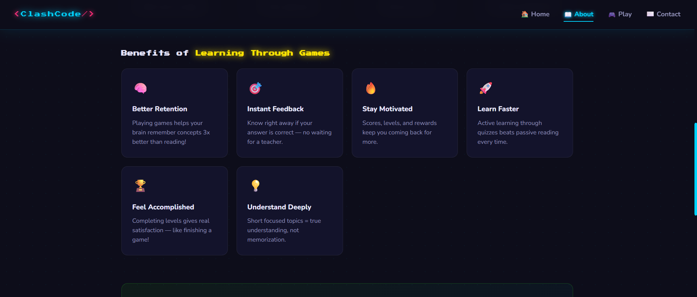 | 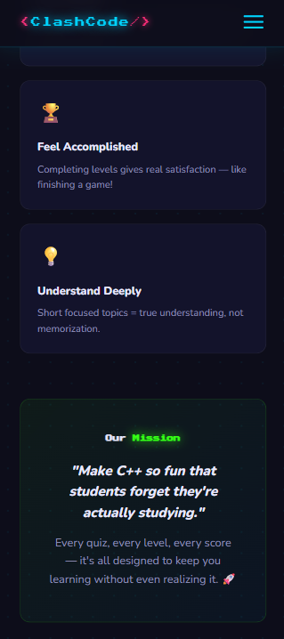 |
| 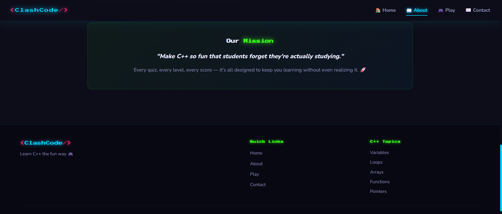 | *(continued above)* |

---

### 🎮 Services / Game Zone

| Desktop | Mobile |
|---------|--------|
| 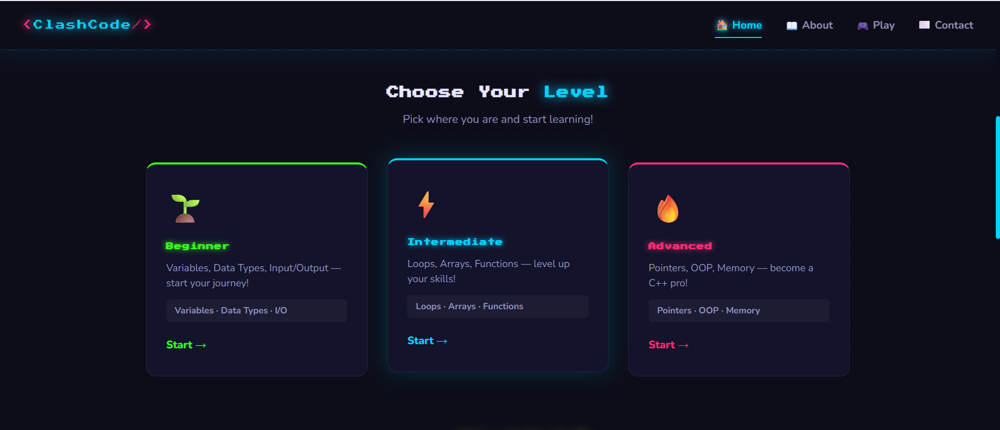 | 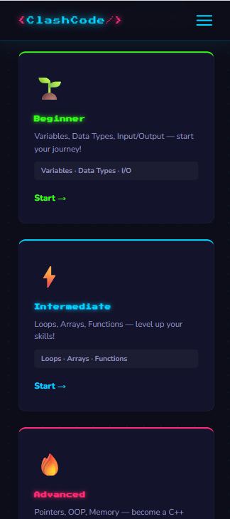 |

**Quiz in Action:**

| Play — View 1 | Play — View 2 |
|---------------|---------------|
| 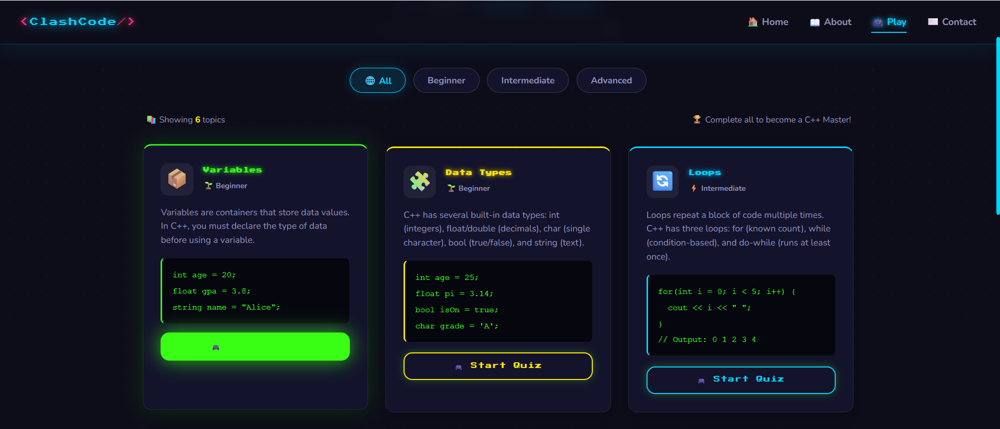 | 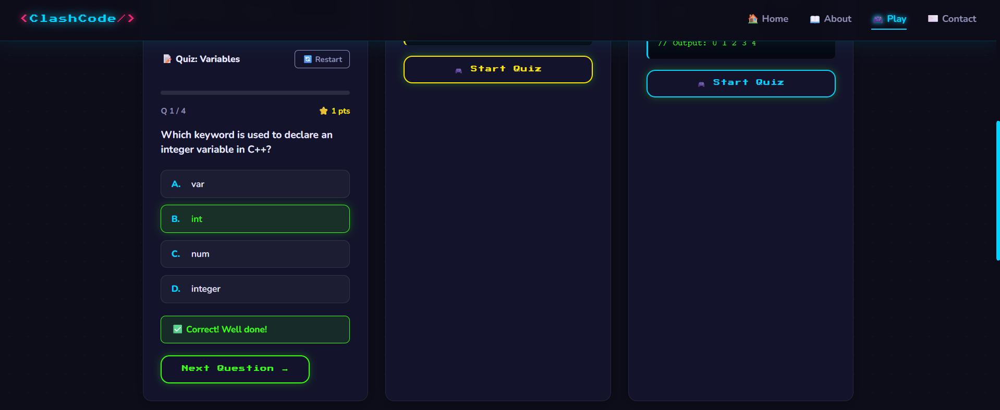 |

**Mobile Quiz Experience:**

| Mobile — View 1 | Mobile — View 2 |
|-----------------|-----------------|
| 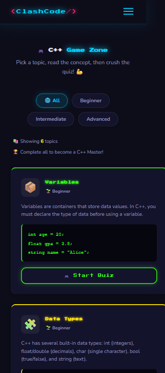 | 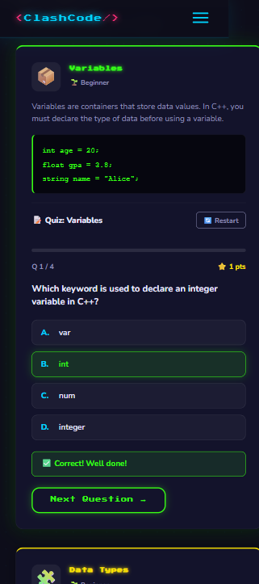 |

---

### 📄 Why ClashCode

| Desktop | Mobile |
|---------|--------|
| 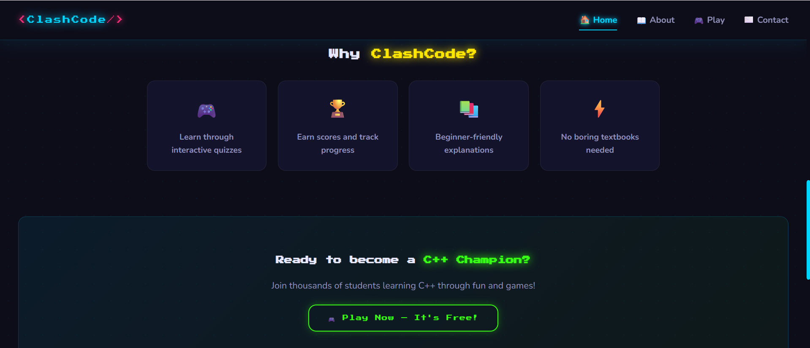 | 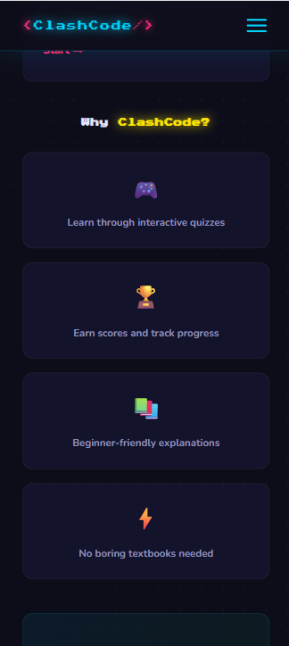 |

---

### ✉️ Contact Page

| Desktop | Mobile |
|---------|--------|
| 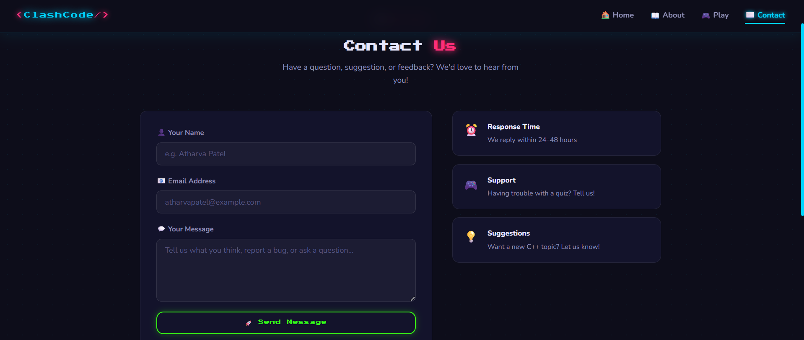 | 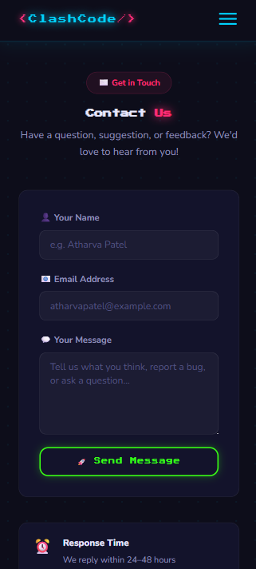 |

---

### 📱 Mobile Navigation

| Hamburger Menu |
|----------------|
| 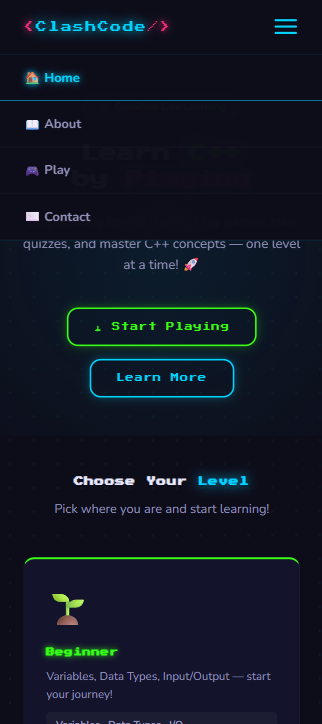 |

---

### 🦶 Footer

| Desktop | Mobile |
|---------|--------|
| 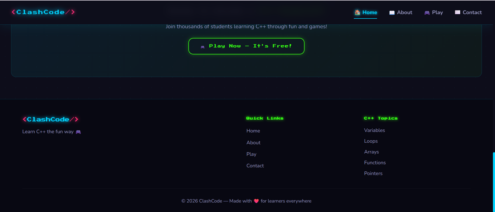 | 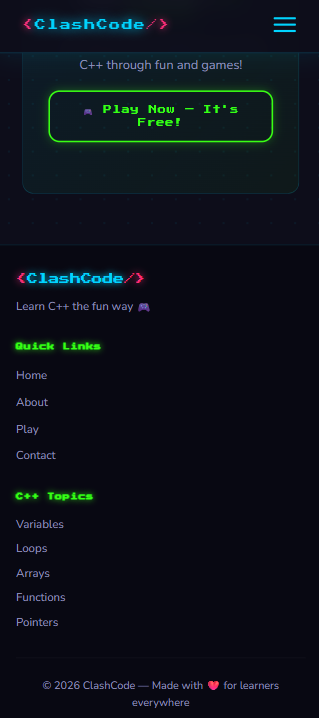 |

---

## 📄 Pages Overview

### 🏠 Home Page `/`
- Animated hero section with pixel-font title
- Three learning level cards (Beginner, Intermediate, Advanced)
- Feature highlights section
- Call-to-action banner linking to the Game Zone

### 📖 About Page `/about`
- Problem statement: why traditional C++ learning fails
- Explanation of gamified learning with a visual step-by-step flow
- Benefits grid (6 cards: retention, feedback, motivation, speed, etc.)
- Mission statement banner

### 🎮 Services / Game Zone `/services`
- All 6 C++ topic cards displayed in a responsive grid
- Level filter buttons (All / Beginner / Intermediate / Advanced)
- Each card expands in-place to show the quiz
- Restart and Next Level buttons per card

### ✉️ Contact Page `/contact`
- Contact form: Name, Email, Message fields
- Client-side validation with error messages
- Success confirmation screen after submission
- Info sidebar: location, response time, support details

---

## 🛠 Tech Stack

| Technology | Version | Purpose |
|---|---|---|
| **React.js** | 18.x | UI library, component architecture |
| **Vite** | 5.x | Build tool and dev server |
| **React Router DOM** | 6.x | Client-side page routing |
| **CSS3** | — | Custom styling with CSS variables |
| **Google Fonts** | — | Press Start 2P + Nunito |

> No UI framework (like MUI or Bootstrap) is used — all styles are handcrafted for full control and a unique gaming aesthetic.

---

## 🚀 Getting Started

### Prerequisites

Make sure you have the following installed:

- [Node.js](https://nodejs.org/) `v18+`
- [npm](https://www.npmjs.com/) `v9+` (comes with Node)

### Installation

**1. Clone the repository**
```bash
git clone https://github.com/your-username/learn-cpp-play.git
cd learn-cpp-play
```

**2. Install dependencies**
```bash
npm install
npm install react-router-dom
```

**3. Start the development server**
```bash
npm run dev
```

**4. Open in browser**
http://localhost:5173

### Build for Production

```bash
npm run build
```

The optimized output will be in the `dist/` folder, ready to deploy on Vercel, Netlify, or GitHub Pages.

### Preview Production Build

```bash
npm run preview
```

---

## 📘 C++ Topics Covered

| # | Topic | Level | Questions |
|---|---|---|---|
| 1 | 📦 **Variables** | 🌱 Beginner | 4 MCQs |
| 2 | 🧩 **Data Types** | 🌱 Beginner | 4 MCQs |
| 3 | 🔄 **Loops** | ⚡ Intermediate | 4 MCQs |
| 4 | 📊 **Arrays** | ⚡ Intermediate | 4 MCQs |
| 5 | ⚙️ **Functions** | ⚡ Intermediate | 4 MCQs |
| 6 | 🎯 **Pointers** | 🔥 Advanced | 4 MCQs |

> **Total: 24 quiz questions** across 3 difficulty levels.  
> More topics can easily be added by extending the `topics` array in `Services.jsx`.

---

## 🧠 Quiz System

The quiz engine (`Quiz.jsx`) is built entirely with React `useState`. Here's how it works:
User clicks "Start Quiz"
↓
Question shown one at a time
↓
User selects an answer
↓
✅ Correct → Score +1 + green highlight
❌ Wrong   → Red highlight + correct answer revealed
↓
"Next Question" button appears
↓
Repeat until all questions done
↓
Final Score screen with emoji rating + Restart / Next Level buttons

**Score Rating:**

| Score % | Emoji | Message |
|---|---|---|
| 80 – 100% | 🏆 | Excellent! You're a C++ star! |
| 50 – 79%  | 🎯 | Good job! Almost there! |
| 0 – 49%   | 😢 | Keep practicing! |

---

## 🧩 Components

### `<Navbar />`
- Sticky top bar with logo and 4 navigation links
- Active link highlighting based on current route
- Hamburger menu for mobile screens (toggle with `useState`)

### `<Footer />`
- Three-column layout: Brand | Quick Links | C++ Topics
- Responsive — stacks to single column on mobile

### `<GameCard topic={} onNextLevel={} />`
- Accepts a `topic` object (title, description, icon, color, questions, codeSnippet)
- "Start Quiz" button expands the card in-place
- Contains a "Restart" button that resets the quiz via React key trick

### `<Quiz questions={[]} onNextLevel={} />`
- Fully self-contained quiz engine
- Props: `questions` array + optional `onNextLevel` callback
- Manages all state internally: `currentQ`, `score`, `selected`, `answered`, `finished`

---

## 🤝 Contributing

Contributions are welcome and appreciated! Here's how:

1. **Fork** the repository
2. **Create** a feature branch: `git checkout -b feature/new-topic`
3. **Commit** your changes: `git commit -m "Add: Strings topic with quiz"`
4. **Push** to the branch: `git push origin feature/new-topic`
5. **Open** a Pull Request

### Ideas for Contributions
- 🆕 Add new C++ topics (Strings, Classes, OOP, STL, etc.)
- 🌍 Add more quiz questions per topic
- 🏅 Add a global leaderboard with localStorage
- 🎵 Add sound effects for correct/wrong answers
- 🌐 Add multi-language support

---

## 👨‍💻 Author

Built with ❤️ for students who hate boring C++ textbooks.

> If this project helped you learn C++, give it a ⭐ — it means a lot!

<div align="center">

**[⬆ Back to Top](#-clashcode--learn-c-through-play)**

</div>